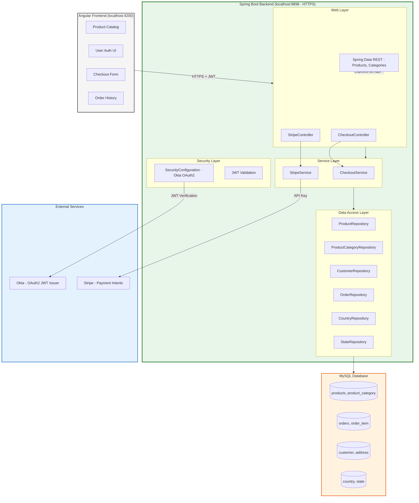
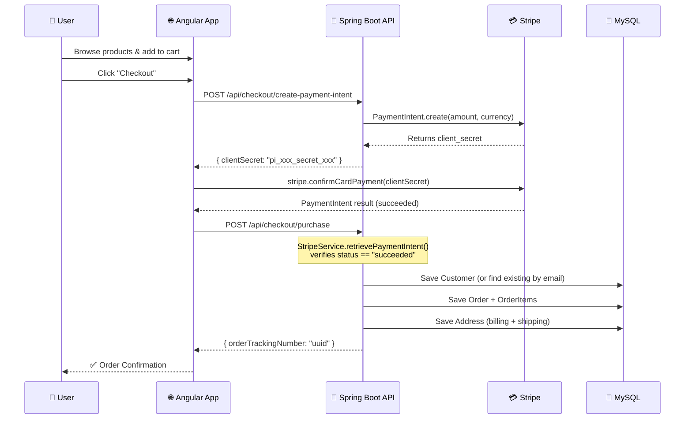
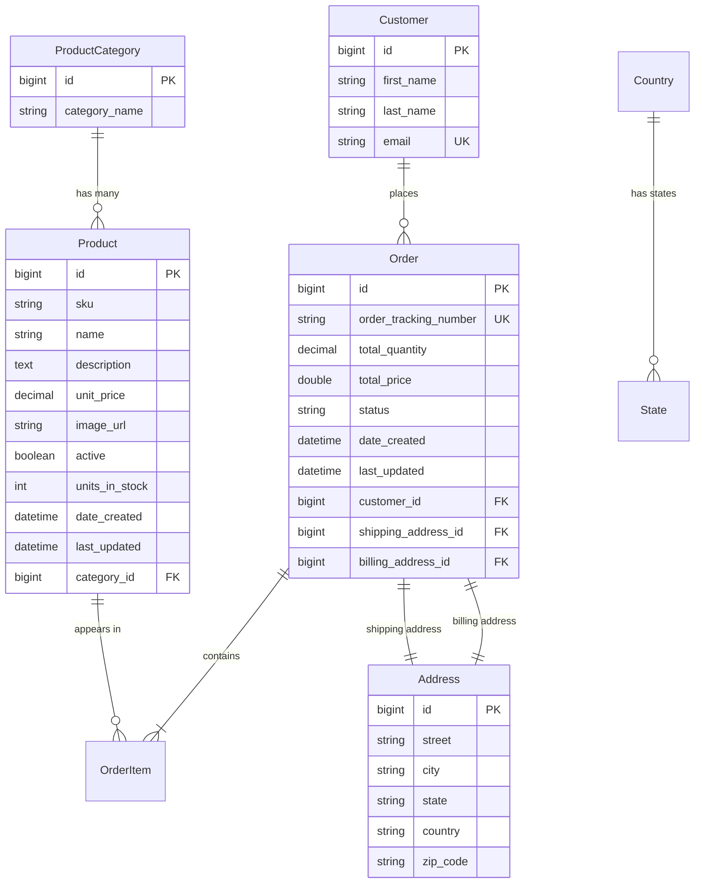
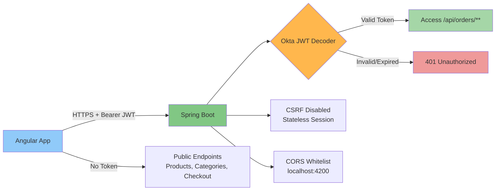

# IsmaCart — Full-Stack E-Commerce Platform

<p align="center">
  
  
  
  
  
  
  
  
  
</p>

> **A production-grade e-commerce backend built with Spring Boot 3.2 + Angular 17, featuring secure checkout powered by Stripe, OAuth2 authentication via Okta, and a RESTful API architecture.**

---

## Architecture Overview



---

## ✨ Key Features

| Feature | Implementation |
|---|---|
| **Product Catalog** | Spring Data REST auto-exposes `/api/products` with pagination, search by name, and filtering by category |
| **Secure Checkout** | `POST /api/checkout/purchase` — processes order + verifies Stripe PaymentIntent |
| **Stripe Payments** | `POST /api/checkout/create-payment-intent` — server-side PaymentIntent creation |
| **OAuth2 / JWT Auth** | Okta resource server protects `/api/orders/**`; all other endpoints public |
| **HTTPS only** | Server runs on port **9898** with PKCS12 keystore, SSL enabled |
| **CORS** | Whitelisted origins: `https://localhost:4200`, `http://localhost:4200` |
| **Read-Only REST** | PUT/POST/DELETE/PATCH disabled on Product, Category, Country, State, Order (safety) |
| **Entity ID Exposure** | All JPA entity IDs exposed in JSON responses for frontend consumption |

---

## Checkout Flow — 3D Sequence



---

## Data Model — Entity Relationship



---

## Tech Stack

| Technology | Proficiency |
|---|---|
| Java 21 / Spring Boot 3.2 | ██████████ |
| Angular 17 / TypeScript | ████████░░ |
| REST API Design | ██████████ |
| Stripe Payments | ████████░░ |
| OAuth2 / Okta | ████████░░ |
| JPA / Hibernate | ████████░░ |
| MySQL | ██████████ |
| HTTPS / SSL | ██████░░░░ |
| Git / CI | ██████░░░░ |

---

## 📁 Project Structure

```
E-commerce Project/
├── BackEnd/
│   └── Ecommerce/                        # Spring Boot 3.2 Application
│       ├── src/main/java/com/ismail/Ecommerce/
│       │   ├── config/
│       │   │   ├── SecurityConfiguration.java   # Okta OAuth2 + JWT config
│       │   │   ├── MyDataRestConfig.java        # CORS, ID exposure, HTTP method restrictions
│       │   │   └── MyAppConfig.java
│       │   ├── controller/
│       │   │   ├── CheckoutController.java      # POST /api/checkout/purchase
│       │   │   └── StripeController.java         # POST /api/checkout/create-payment-intent
│       │   ├── dao/                             # Spring Data JPA Repositories
│       │   │   ├── ProductRepository.java       # findByCategoryId, findByNameContaining
│       │   │   ├── CustomerRepository.java      # findByEmail
│       │   │   ├── OrderRepository.java
│       │   │   ├── ProductCategoryRepository.java
│       │   │   ├── CountryRepository.java
│       │   │   └── StateRepository.java
│       │   ├── dto/
│       │   │   ├── Purchase.java                # Order + Customer + Addresses + PaymentIntentId
│       │   │   ├── PurchaseResponse.java        # Order tracking number response
│       │   │   ├── PaymentInfo.java             # Amount + currency
│       │   │   └── PaymentResponse.java         # Stripe client secret
│       │   ├── entity/
│       │   │   ├── Product.java                 # @ManyToOne -> ProductCategory
│       │   │   ├── ProductCategory.java         # @OneToMany -> Product
│       │   │   ├── Order.java                   # @OneToMany -> OrderItem, @ManyToOne -> Customer
│       │   │   ├── OrderItem.java
│       │   │   ├── Customer.java
│       │   │   ├── Address.java
│       │   │   ├── Country.java
│       │   │   └── State.java
│       │   └── service/
│       │       ├── CheckoutService.java         # Interface
│       │       ├── CheckoutServicImplementation.java  # Place order + verify Stripe payment
│       │       └── StripeService.java           # Create & retrieve PaymentIntents
│       └── src/main/resources/
│           └── application.properties           # DB, Stripe, Okta, SSL config
│
└── Frontend/
    └── angular-Ecommerce/                      # Angular 17 Frontend
        ├── src/
        ├── ssl-localhost/                      # Local HTTPS certificates
        └── angular.json
```

---

## 🔌 API Endpoints

| Method | Endpoint | Auth | Description |
|---|---|---|---|
| `GET` | `/api/products` | Public | Paginated product list |
| `GET` | `/api/products/search/findByCategoryId?id={id}` | Public | Filter by category |
| `GET` | `/api/products/search/findByNameContaining?name={name}` | Public | Search by name |
| `GET` | `/api/product-category` | Public | All categories |
| `GET` | `/api/countries` | Public | All countries |
| `GET` | `/api/states` | Public | All states |
| `POST` | `/api/checkout/create-payment-intent` | Public | Creates Stripe PaymentIntent |
| `POST` | `/api/checkout/purchase` | Public | Places order (with Stripe verification) |
| `*` | `/api/orders/**` | **JWT Required** | Order CRUD (authenticated only) |

> All other entity endpoints are **read-only** — PUT/POST/PATCH/DELETE disabled for safety.

---

## 🚀 Getting Started

### Prerequisites

- Java 21+
- Node.js 18+ & npm
- MySQL 8.0+
- Stripe account (test keys)
- Okta account (for OAuth2)

### Backend Setup

```bash
cd BackEnd/Ecommerce

# Configure environment variables
export DB_USERNAME=root
export DB_PASSWORD=yourpassword
export STRIPE_SECRET_KEY=sk_test_...
export OKTA_CLIENT_ID=...
export OKTA_ISSUER=https://{your-okta-domain}/oauth2/default
export SSL_PASSWORD=your-keystore-password

# Run the application (port 9898, HTTPS)
./mvnw spring-boot:run
```

### Frontend Setup

```bash
cd Frontend/angular-Ecommerce
npm install
ng serve --ssl --ssl-cert ./ssl-localhost/localhost.crt --ssl-key ./ssl-localhost/localhost.key
```

---

## 🛡️ Security Architecture



---

## ⚡ Performance Considerations

- **Spring Data REST** auto-generates paginated, sorted queries — no boilerplate
- **JPA Lazy Loading** prevents N+1 on large product catalogs
- **Stripe API** called server-side — secret key never exposed to client
- **HTTPS** enforced globally; localhost dev also uses SSL certificates
- **MySQL 8** with proper indexing on `email` (unique), `category_id`, `order_tracking_number`

---

## 📬 Contact

Built by **Ismail** — feel free to connect or contribute!

[](https://github.com/Xframex)
[](https://github.com/Xframex/Ecommerce)
